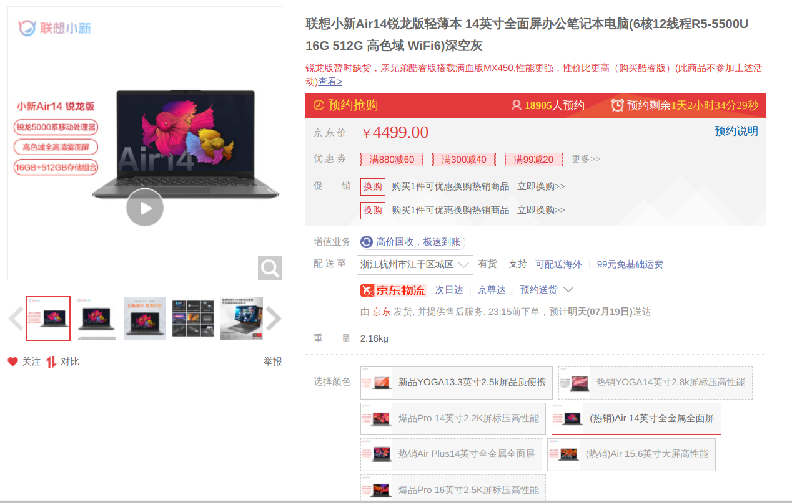
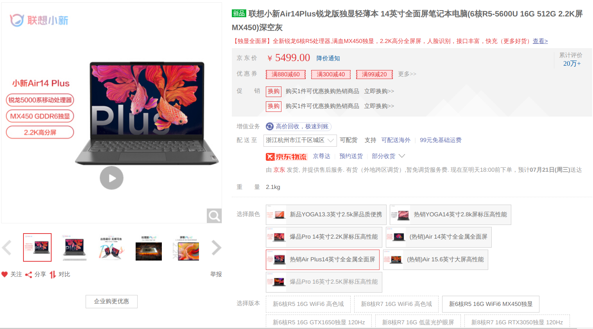
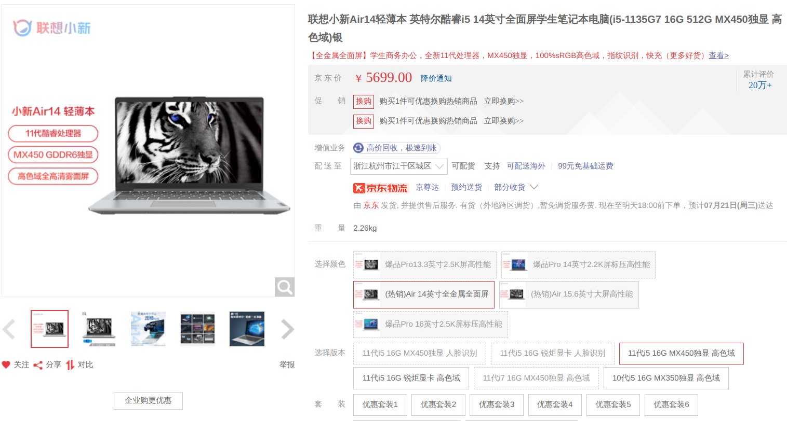
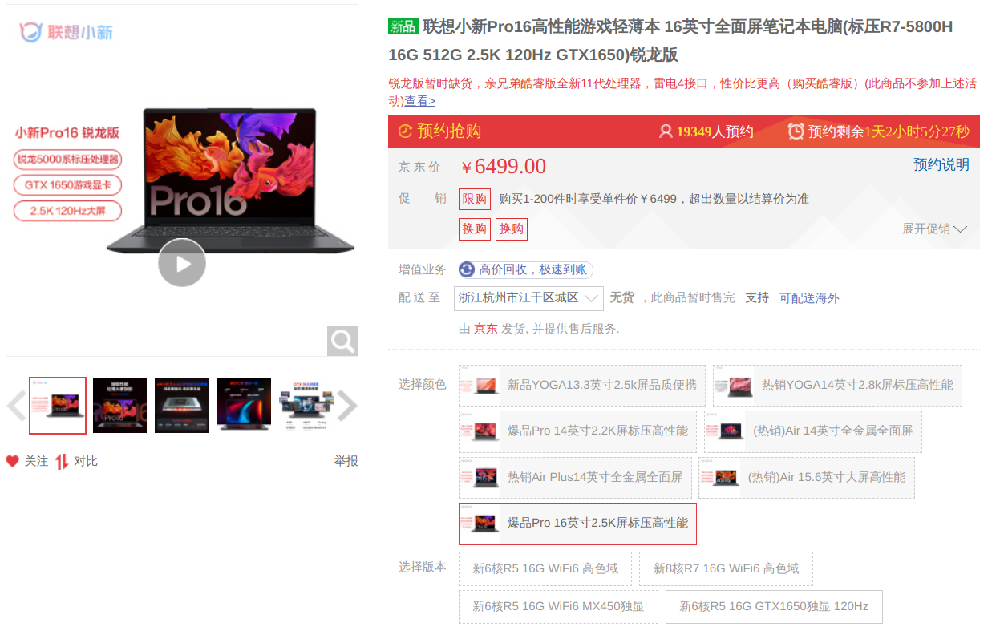
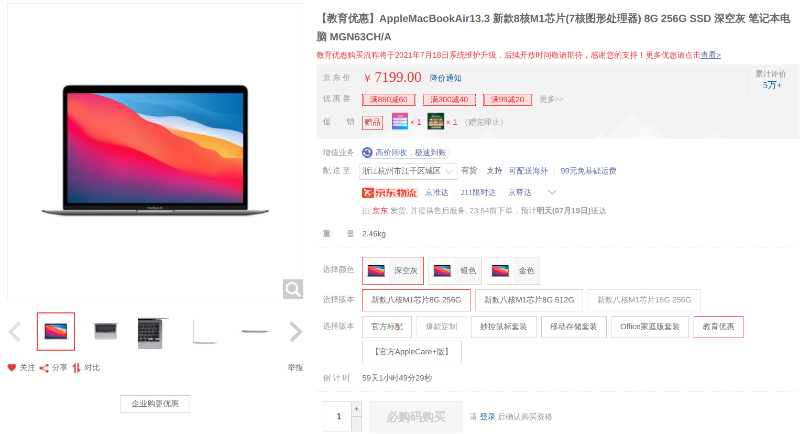

# 笔记本推荐：

## 推荐原则

1. 数码圈通用买新不买久原则
2. 以性价比为优先考虑
3. 只推荐常规的笔记本
4. 同类型笔记本之中价位适中选择
5. 大品牌优先原则(各方面都省心一些)
6. 以2021年7月20日之前几天京东官方旗舰店价格为参考
7. 假设你使用电脑的习惯不错(好的习惯能让电脑延年益寿，同理反之)

## 预备知识

### 了解自己的需求

1. 娱乐游戏方面上对电脑配置的需求
2. 专业学习上对电脑配置的需求(3D建模与图形渲染、视频剪辑等)

## 推荐机型

1. 联想小新Air14锐龙版 **2021**

    * **截图**
      
    * **京东店铺名**：联想京东自营旗舰店
    * **理由**：联想的小新系列一直以来都卖得很不错，它不仅产品线很全，而且能让你在一个合适的价位上能满足大部分人需求，另外的话... ~~联想，大牌子~~
    * **缺点**：缺货
    * **适合人群**：文字类工作、正常修图、业余剪辑、轻度游戏、轻度3D建模需求

2. 联想小新Air14Plus锐龙版独显轻薄本 **2021**

    * **截图**
      
    * **京东店铺名**：联想京东自营旗舰店
    * **理由**：相比于没有Plus的版本多了一个MX450的英伟达独立显卡，使得轻薄本的功能进一步延伸，达到可以玩一些大型游戏的水准。然后还有就是有了一块2K的屏幕，可以说还是挺不错的。
    * **缺点**：偶尔缺货
    * **适合人群**：文字类工作、正常修图、业余剪辑、中度游戏、中度3D建模需求

3. 联想小新Air14 Intel版 **2021**

    * **截图**
    
    * **京东店铺名**：联想京东自营旗舰店
    * **理由**：作为前两种推荐的次选，如果抢不到锐龙版的可以考虑Intel版的
    * **缺点**：性价比较前两者稍低
    * **适合人群**：文字类工作、正常修图、业余剪辑、中度游戏、中度3D建模需求

4. 联想小新Pro16锐龙版(RTX/GTX) **2021**

    * **截图**
    
    * **京东店铺名**：联想京东自营旗舰店
    * **理由**：Pro16这样的笔记本一般被称为全能本，GTX1650/RTX3050均为入门级的游戏显卡，性能上接近配置接近的大部分游戏本，优先选择RTX3050的版本
    * **缺点**：因为一些懂得都懂的原因比较难买
    * **适合人群**：文字类工作、正常修图、业余剪辑、中高度游戏、中高度3D建模需求

5. Apple MacBook Air 13.3 新款八核**M1芯片**

    * **截图**
    
    * **京东店铺名**：Apple产品京东自营旗舰店
    * **理由**：由于M1芯片确实相当强大，所以苹果生态下的Mac是一个相当不错的选择。而且可以享受教育优惠
    * **缺点**：512G硬盘版本的价格比256G硬盘版本的价格贵出1800的离谱价格，需要多考虑，个人推荐买256G版本的，后续有更大容量需求的可以考虑买移动硬盘
    * **适合人群**：文字类工作、正常修图、业余剪辑、轻度3D建模需求
