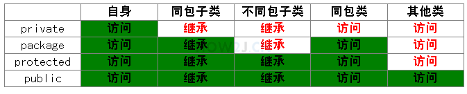

# 名词概念解释

## 基本名词

1. 类和对象
2. 属性（成员变量，字段，Field）
3. 方法
4. 二维数组  

   ```java
    int b[][] = new int[][]{
    {1,2,3},
    {4,5,6},
    {7,8,9}
    };
    ```

    示例：

    ```java
    //Hero是类名
    public class Hero{
    //以下是属性名
        String name;        //名称
        float hp;           //血量
        float armor;        //护甲
    //这是一个类属性/静态属性
        static String copyright="Riot Games";
    //以下是方法
        void legendary(){
            System.out.println("超神!");
        }
    }
    ```

## 引用

```java
//garen是一个引用
    Hero garen = New Hero();
```

## 对象转型

[how2j.cn 对象转型](https://how2j.cn/k/interface-inheritance/interface-inheritance-casting/308.html)

## 循环

1. break高级用法  

    ```java
    outline:
    for(){
        for(){
            break outline;  //退出多层循环
        }
    }
    ```

2. 增强for循环  
   只能用来遍历/取值

   ```java
    int array[] ={10,20,30}
    for(int each : array){
        if (each == 20) return each;
    }
   ```

## 对象继承

```java
public class ADHero extends Hero(){     
    //ADHero类继承了Hero类的属性，没有加final修饰符的方法
    //ADHero类是Hero类的子类
}
```

## 方法重载

一个方法可能会出现需要不同个数参数的情况下使用

```java
public void attack()
public void attack(Hero h1)
public void attack(Hero h1, Hero h2)
```

## 方法重写

子类覆盖父类的**对象方法**
又叫覆盖 override
*对象是啥类型就输出啥类型的方法*

## 方法隐藏

子类覆盖父类的类**方法**
*引用是啥类型就输出啥类的方法*

### 参数数量可变的写法

存在多个参数类型均一致时

```java
    // 可变数量的参数   
    public void attack(Hero... heros) {
        for (int i = 0; i < heros.length; i++) {
            System.out.println(name + " 攻击了 " + heros[i].name);
        }
    }
```

## 构造方法

与方法名与类名相同的方法，可以进行带参初始化，可以被重载，

## 接口

1. 使用了某个接口的类需要实现其中的方法
2. 接口中可以提供默认方法

```java
public interface AD {
    public void physicAttack();     //空方法
    default public void attack(){   //默认方法
        System.out.println("AD发起了一次攻击");
    }
}
```

## this

this这个关键字，相当于普通话里的“我”
this可以访问当前类的成员变量/方法

## super

super可以访问父类的成员变量/方法

## 包

对比较接近的类进行归类存放
使用其他包里的类需要import

## 操作符

[HOW2J.cn](https://how2j.cn/k/operator/operator-arithmetic/265.html)

## 修饰符

### final  

被**final修饰**的___
    * 变量:只有一次赋值的机会  
    * 类  :不能够被继承  
    * 方法:不能够被重写  
    * 引用:只有一次指向对象的机会  
**常量**：可以公开，直接访问，不会变化的值  
public static final int itemTotalNumber = 6;

### abstract  

**抽象方法**：被abstract修饰的**空**方法  
**抽象类**：含有抽象方法的类，其子类需要实现该方法  

### static

修饰属性时称为**类属性**或**静态属性**，所以对象都共享一个值
修饰方法时称为**类方法**或**静态方法**，不需要对象就能直接调用类方法

### 访问修饰符

1. private
2. package/fringly/default (不写)
3. protected
4. public


## 单例模式

使类具有只能被实例化一次的属性
[HOW2J.cn 单例模式](https://how2j.cn/k/class-object/class-object-singleton/349.html#step5904)

单例模式**三个条件**

1. 构造方法私有化
2. 静态属性指向实例
3. public static的 getInstance方法，返回第二步的静态属性

## 多态

1. 操作符的多态
   如 + 可以作为算数运算，也可以作为字符串连接
2. 类的多态
   父类引用指向子类对象
   条件：
   1. 父类（接口）引用指向子类对象
   2. 调用的方法重写

## 枚举类

```java
    public enum Season {
        SPRING,SUMMER,AUTUMN,WINTER
    }
```

## 内部类

### 非静态内部类

```java
package charactor;
 
public class Hero {
    private String name; // 姓名
 
    float hp; // 血量
 
    float armor; // 护甲
 
    int moveSpeed; // 移动速度
 
    // 非静态内部类，只有一个外部类对象存在的时候，才有意义
    // 战斗成绩只有在一个英雄对象存在的时候才有意义
    class BattleScore {
        int kill;
        int die;
        int assit;
 
        public void legendary() {
            if (kill >= 8)
                System.out.println(name + "超神！");
            else
                System.out.println(name + "尚未超神！");
        }
    }
 
    public static void main(String[] args) {
        Hero garen = new Hero();
        garen.name = "盖伦";
        // 实例化内部类
        // BattleScore对象只有在一个英雄对象存在的时候才有意义
        // 所以其实例化必须建立在一个外部类对象的基础之上
        BattleScore score = garen.new BattleScore();
        score.kill = 9;
        score.legendary();
    }
 
}

```

### 静态内部类

```java
package charactor;
  
public class Hero {
    public String name;
    protected float hp;
  
    private static void battleWin(){
        System.out.println("battle win");
    }
     
    //敌方的水晶
    static class EnemyCrystal{
        int hp=5000;
         
        //如果水晶的血量为0，则宣布胜利
        public void checkIfVictory(){
            if(hp==0){
                Hero.battleWin();
                 
                //静态内部类不能直接访问外部类的对象属性
                System.out.println(name + " win this game");
            }
        }
    }
     
    public static void main(String[] args) {
        //实例化静态内部类
        Hero.EnemyCrystal crystal = new Hero.EnemyCrystal();
        crystal.checkIfVictory();
    }
  
}
```

### 匿名类

匿名类指的是在声明一个类的同时实例化它，使代码更加简洁精练
通常情况下，要使用一个接口或者抽象类，都必须创建一个子类

有的时候，为了快速使用，直接实例化一个抽象类，并“当场”实现其抽象方法。
既然实现了抽象方法，那么就是一个新的类，只是这个类，没有命名。
这样的类，叫做匿名类

内部类与匿名类不一样的是，内部类必须声明在成员的位置，即与属性和方法平等的位置。

```java
Hero h = new Hero(){
    //当场实现attack方法
    public void attack() {
        System.out.println("新的进攻手段");
    }
}
```

### 本地类

可以理解为有名字的内部类
本地类和匿名类一样，直接声明在代码块里面，可以是主方法，for循环里等等地方

## 抽象类

用abstract修饰的类

## 常用类

### Arrays————针对数组的工具类

| 关键字         | 简介         |
| -------------- | ------------ |
| copyOfRange()  | 数组复制     |
| toString()     | 转化为字符串 |
| sort()         | 转换为字符串 |
| binarySearch() | 排序         |
| equals()       | 搜索         |
| fill()         | 填充         |

### Object————所有类的父类

| 关键字      | 简介               |
| ----------- | ------------------ |
| toString()  | 转化为字符串       |
| clone()     | 返回一个对象的拷贝 |
| euals()     | 判断对象是否相同   |
| hashCode()  | 返回对象的哈希值   |
| wait()      |
| notify()    |
| notifyAll() |
| getClass()  |

## 常用方法

1. System.arraycopy(src, srcPos, dest, destPos, length)
   复制数组src的值到数组dest
