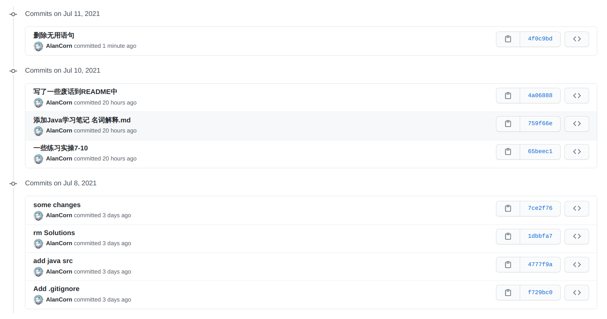
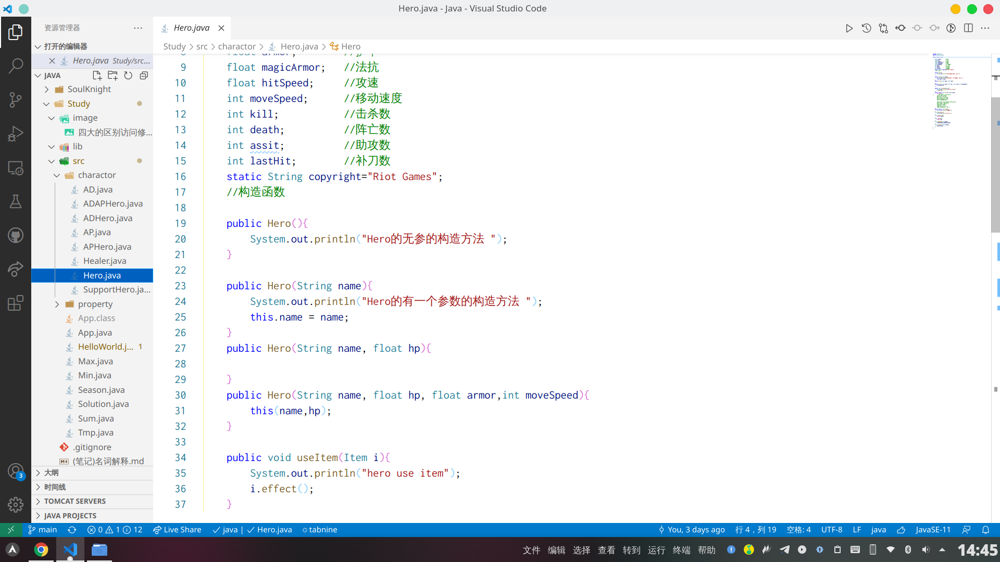

# 工作周报

## 本周学习内容

###### (内容概述+成果物链接)
1. 深度学习了Java初级内容，掌握基本概念
2. 深度学习Git相关的知识能熟练在命令行使用Git工具
3. 对HTML5做了简单入门
4. 学习了一小部分的JSP

[成果物链接](https://github.com/AlanCorn/JavaStudy)

## 本周项目内容

###### (项目进展)

1. 熟悉项目文档
2. 查找时间银行从被提出到现在所经历的发展，查找其现状、背景、国内外的发展状况并整理成文档

## 本周反思总结

###### (反思总结)

1. 在JSP的学习上遇到了一些困难,需要花更多时间去好好研究
2. 对项目的调查还不够深入,会议中没能提出有建设性的想法,需要增强团队意识,共同努力

## 下周学习计划

###### (学习计划)

1. 根据内训文档继续学习JSP
2. 不断巩固Java,穿插学习一些中高级Java特性
3. 开始学习HTML5+CSS+JavaScript

## 下周项目计划

###### (项目计划)

1. 查询更多的文档,多思考思考项目的难点和痛点,并且与组员交流
2. 开始设想项目如何实现
3. 学会画线框图
4. 完成队长布置的任务

## 图片

###### (git提交记录 代码截图)

## 提供附件

[TimeBank](Time%20Bank%20发展及现状.pdf)