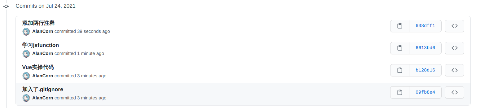

# 工作周报

## 本周学习内容

###### (内容概述+成果物链接)

学习Vue框架
https://github.com/AlanCorn/WebStudy

## 本周项目内容

###### (项目进展)

完成了项目线框图

## 本周反思总结

###### (反思总结)

需要加快学习进度

## 下周学习计划

###### (学习计划)

继续学习Vue

## 下周项目计划

###### (项目计划)

完善、改进线框图

## 图片

###### (git提交记录 代码截图)

