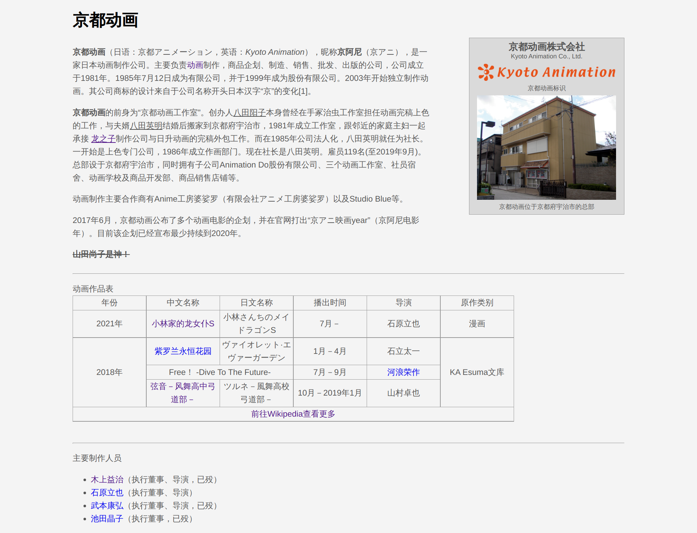

# 工作周报

## 本周学习内容

###### (内容概述+成果物链接)

1. 重点学习了CSS并自行制作了一个小页面
2. 在MDN学习JavaScript

[成果物链接](https://github.com/AlanCorn/WebStudy)

## 本周项目内容

###### (项目进展)

1. 进入了初期规划阶段，开始了解并学习项目完成所需要的知识技能

## 本周反思总结

###### (反思总结)

1. 可以再多找一些实践项目做

## 下周学习计划

###### (学习计划)

1. 深入学习web三大件，在Github上找一些开源项目学习
2. 学习Vue.js框架

## 下周项目计划

###### (项目计划)

1. 希望能开始设计线框图

## 图片

###### (git提交记录 代码截图)

